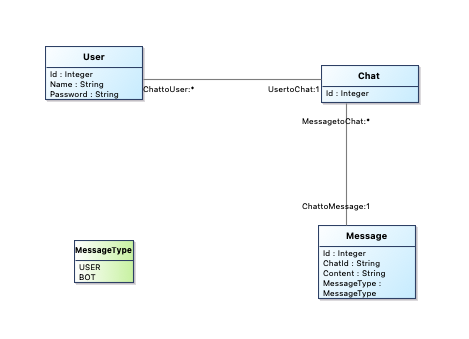
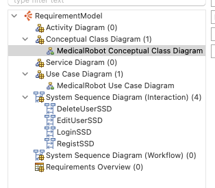
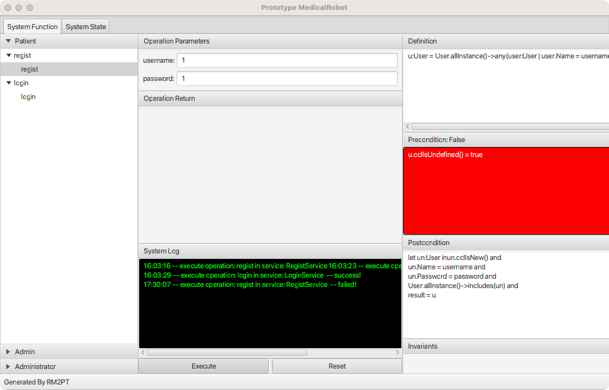
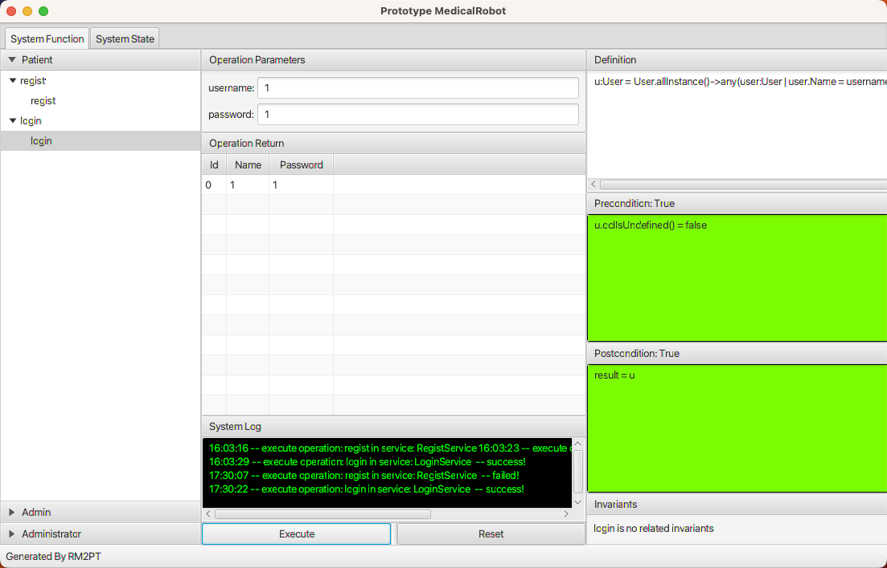
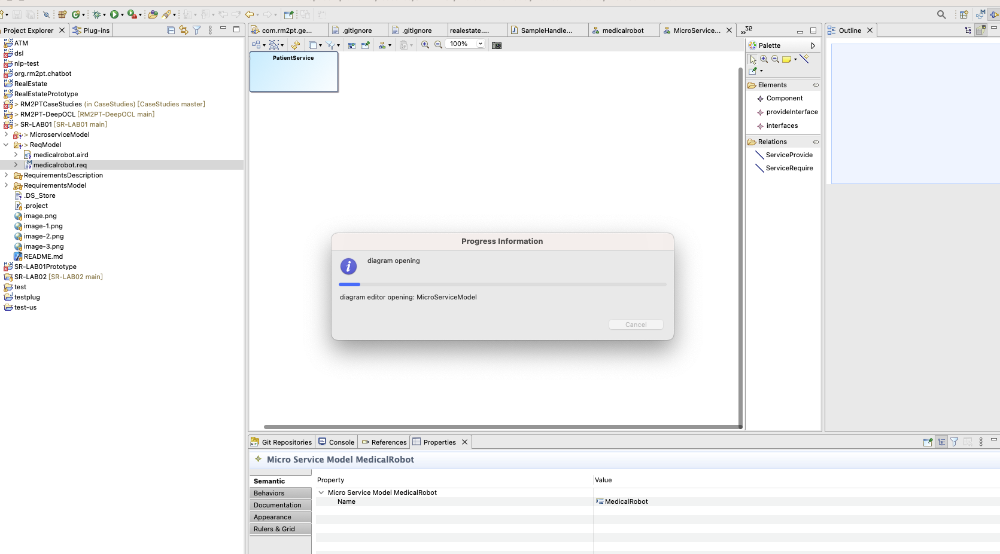
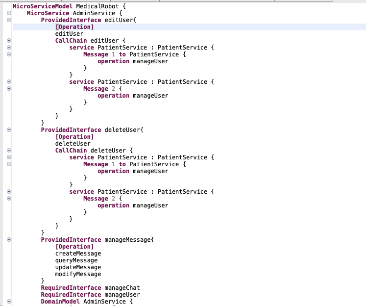
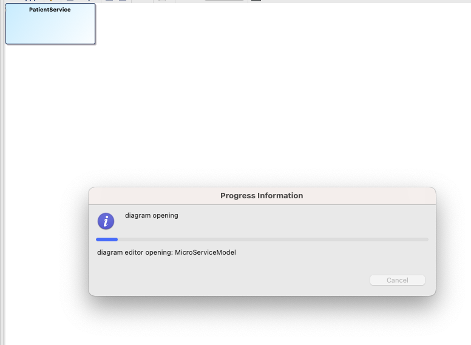

# SR-LAB01

<!-- 实验报告（以项目README文件形式给出），应包含建模结果截图及简要说明、模型规模说明（自然语言需求数量、Actor数量、用例数量、系统顺序图数量、系统操作总数、系统合约数量、类数量）、需求原型化结果截图 -->
## 构建了一个医疗机器人模型，模型类似Chatgpt专注于医疗问答，包含注册以及创建对话等操作，分为用户和系统管理员两个角色，系统管理员主要用于用户的CRUD

1. 自然语言需求数量 - 10
2. Actor数量 - 2
3. 用例数量 - 5
4. 系统顺序图 - 4
5. 系统操作 - 5
6. 系统合约 - 4
7. 类 - 4

- 
- 
- 
- 

# SR-LAB03

- 
- 
## 生成微服务或Design Model的时候卡在
- 
